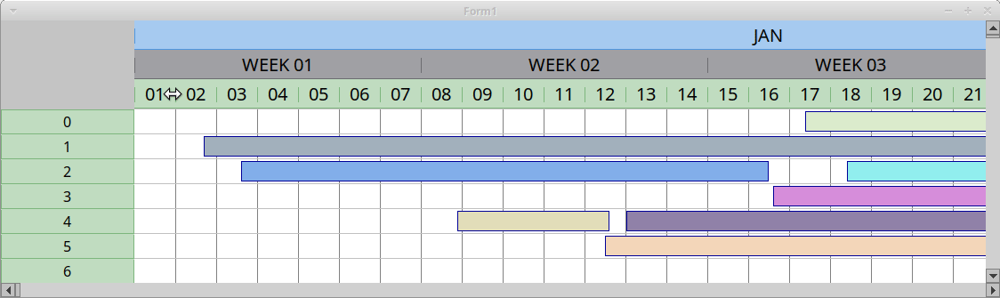
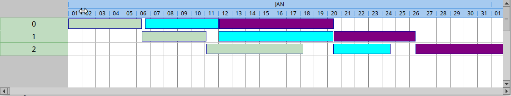

# OboCL
Obo Component Library for Pascal/Lazarus/Delphi.

This library is composed by a set of graphics components and a framework for building reporting systems.
Even if much work was done, the library is not still in its final form as I am focused on additions and refining.

## Timeruler

## Gantt            

